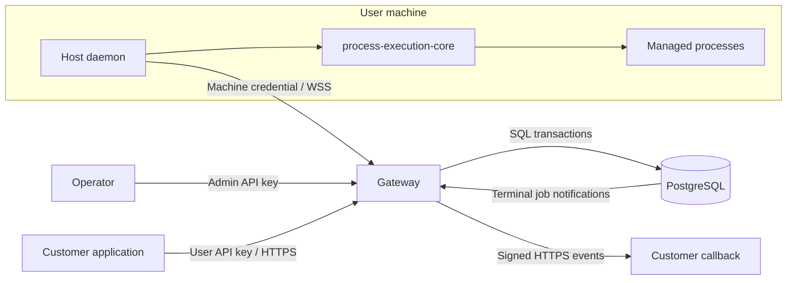
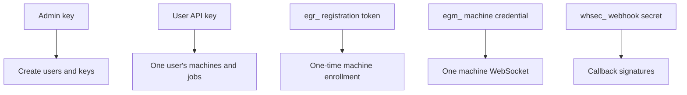
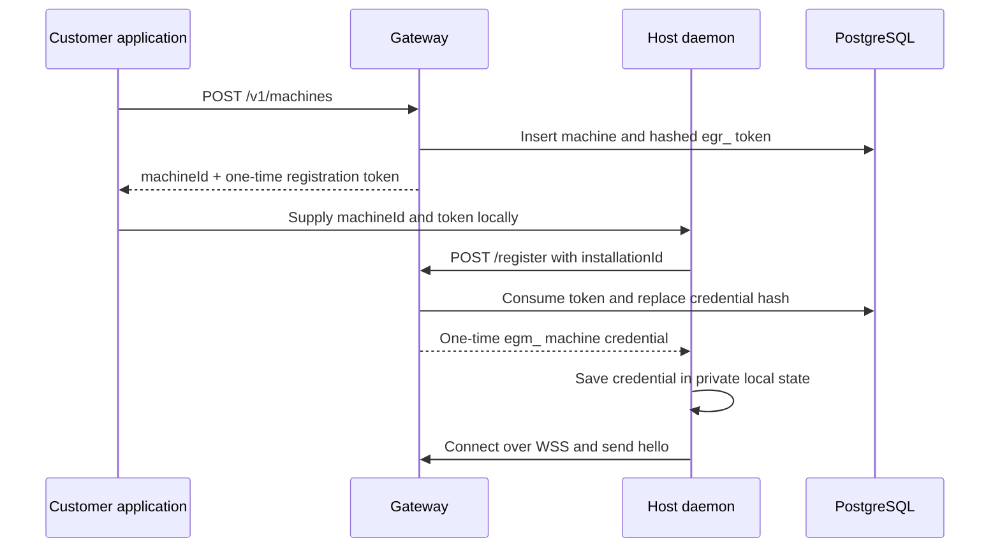
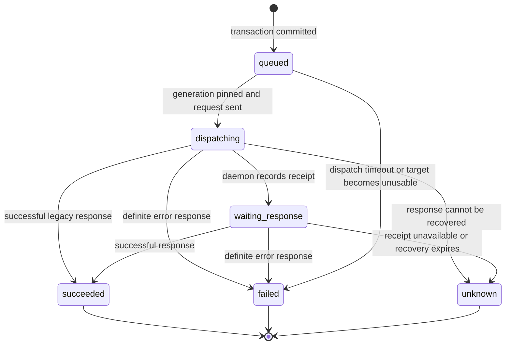
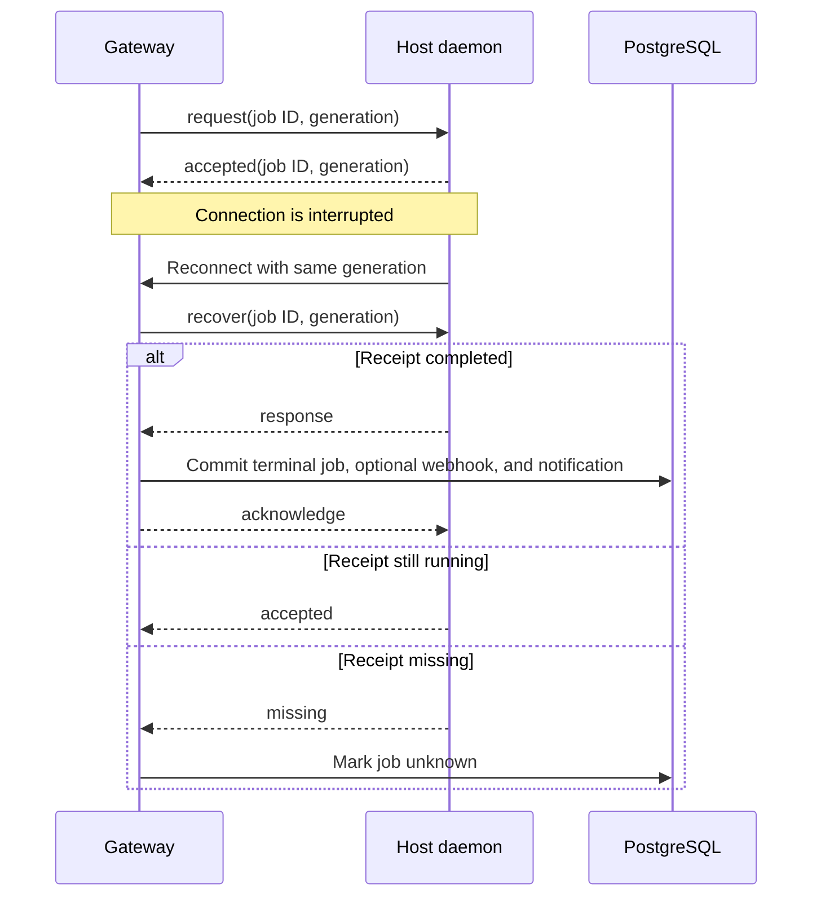

# Execution Gateway architecture

The execution gateway is the control plane between customer applications and process
runtimes installed on user-owned machines. It authenticates users, tracks registered
machines, durably accepts execution jobs, routes them over outbound daemon connections,
and stores each operation or batch response in PostgreSQL.

This document explains the implementation and its failure boundaries. See the
[API reference](api-reference.md) for endpoint and payload details and the
[gateway README](../README.md) for build, configuration, and deployment commands.

## Design goals

The current architecture is built around these guarantees:

- A machine makes an authenticated outbound connection; the gateway opens no inbound
  port on the user's device.
- A job is durable before the API returns `202 Accepted`.
- One job targets one machine and carries either one operation or one batch.
- The gateway never automatically re-executes work whose outcome is uncertain.
- A runtime generation fences handles and accepted requests from daemon restarts.
- Terminal state, retention, the optional webhook event, and its completion wake-up are
  committed atomically.
- Credentials are purpose-specific, owner-scoped, and never stored in plaintext.

The gateway is not a process supervisor. The daemon owns processes, output buffers,
execution handles, and operation retry records. A successful `execution.start` response
can refer to a process that continues after the gateway job has completed.
An `execution.run` job instead remains pending until the daemon returns its terminal
result and bounded output tail; its complete output file remains on the machine.

## System context

The customer application maps its own work to gateway job IDs. The gateway has no
concept of agents, conversations, or sandbox providers.

## Runtime components

One `execution-gateway serve` process contains six logical components:

| Component | Responsibility |
| --- | --- |
| HTTP API | Authentication, validation, ownership checks, and durable admission |
| Connection registry | In-memory map of live machine sockets and runtime generations |
| Machine sessions | Handshake, heartbeat, dispatch, responses, and receipt recovery |
| Maintenance worker | Dispatch timeout, recovery expiry, and request-input cleanup |
| Webhook worker | Outbox claims, signed delivery, retry, and attempt history |
| Completion listener | PostgreSQL notifications and process-local bounded-wait fanout |

PostgreSQL is the durable source of truth for users, machine enrollment, jobs,
responses, and webhook delivery. Live presence and WebSocket writer queues remain in
memory because they describe connections owned by the current process.

The server holds a PostgreSQL session advisory lock for its entire lifetime. A second
gateway process cannot serve the same database. Losing the ownership connection starts
shutdown. This makes connection ownership unambiguous, at the cost of a short handover
during deployment.

## Identity and credential boundaries

The admin key and encryption key live in deployment configuration. Random user keys,
registration tokens, and machine credentials are hashed before storage. The webhook
secret is encrypted because the gateway must recover it to sign outbound requests; the
encryption key never lives in PostgreSQL.

Every user-facing query includes the authenticated `user_id`. A foreign machine, job,
or delivery returns the same `404` as a missing resource. Resource IDs do not grant
access on their own.

Machine credential replacement increments `credential_version`. Each active session
captures the version used at connection time, so later revocation prevents further
state updates or dispatch from that credential.

## Machine lifecycle

### Enrollment

Registration tokens expire after 15 minutes and are consumed transactionally. Issuing
a replacement invalidates unused tokens for the machine. Successful enrollment binds
the daemon's stable installation ID and replaces any earlier machine credential.

### Connection and presence

The daemon upgrades `/v1/machines/{machineId}/connect` to a WebSocket and authenticates
with its machine credential. Its hello includes the installation ID, machine ID,
protocol version, runtime generation, runtime capabilities, binary information, and
receipt-recovery support.

The gateway accepts one connection per machine. A duplicate connection is rejected;
it does not evict the existing runtime. After a valid handshake, the gateway records
the last runtime and binary snapshots and marks the in-memory connection ready.

`online` is computed from this live registry. PostgreSQL stores `last_seen_at` and the
last reported metadata for diagnostics, but it does not store an authoritative online
flag. Heartbeats run every 15 seconds; 45 seconds without valid traffic ends the
connection.

Ordinary network loss and gateway shutdown close the socket without revoking the
credential. The daemon reconnects with backoff. Machine deletion or credential
replacement sends a revocation disconnect, causing the daemon to stop the runtime it
owns.

## Job lifecycle

### Admission and idempotency

The gateway validates and normalizes the operation before admission. It adds protocol
version and request identity only at dispatch time. In one transaction it:

1. Serializes admission for the authenticated user.
2. Resolves `(user_id, idempotency_key)`.
3. Confirms user ownership, user state, machine state, and live presence.
4. Verifies the optional expected runtime generation.
5. Inserts both `jobs` and `job_requests`.

The fingerprint covers the machine ID, normalized request, and optional opaque client
context. An identical retry returns the existing job; adding, removing, or changing
client context or other input with the same key returns a conflict. An omitted context
retains the pre-feature fingerprint shape for compatibility with existing jobs. The
fingerprint remains after request-input cleanup so idempotency remains effective.

### Dispatch and completion

Each connection normally permits up to 32 outstanding requests. Single
`execution.terminate_run` jobs are prioritized and have four additional reserved slots,
so long-running runs cannot consume all cancellation capacity. Before sending, the
gateway rechecks the user, machine, deletion state, and
credential version. It records `dispatching`, the runtime generation, and negotiated
recovery support before writing to the socket.

The daemon sends `accepted` after reserving an in-memory receipt. The gateway then
moves the job to `waiting_response`. When the response arrives, one transaction:

1. Verifies job, machine, request ID, and runtime generation.
2. Stores the complete protocol response.
3. Sets the terminal job state and request-retention deadline.
4. Inserts the webhook outbox event when callbacks are enabled.
5. Emits a transactional terminal-job notification.
6. Commits before acknowledging the daemon receipt.

The gateway uses `succeeded` only when the single operation succeeds or every batch
item succeeds. Operation errors and partial batch results are stored in `response` and
produce `failed`. Gateway-generated failures are stored in `error`. A nonzero process
exit and a failed process launch remain execution results; they do not by themselves
make the operation envelope fail.

### Response recovery

Receipt recovery protects the response to an already accepted request. It never
dispatches the operation again.

On disconnect or gateway restart, recoverable jobs receive a 24-hour recovery deadline.
A reconnect with the same runtime generation queries the receipt. The daemon can return
the completed response, confirm continued acceptance, or report it missing. A daemon
restart changes the generation and loses in-memory receipts, processes, and output
records; affected gateway jobs become `unknown`.

Legacy peers without negotiated recovery mark dispatched work `unknown` after response
loss. Terminal jobs are immutable. A late or duplicate response is acknowledged and
discarded after the durable result has already been chosen.

Queued jobs are different because they have never been dispatched. They may run after a
brief connection interruption, but fail if still queued after 30 seconds.

## Execution, filesystem, and batch ownership

The daemon embeds `process-execution-core` and owns every execution and filesystem action. The gateway stores
only the requested operation or batch and its returned protocol response. There are no
gateway tables for executions, output chunks, or batch child jobs.

One batch is one job. Sequential mode orders operation responses and stops after the
first operation error. Parallel mode runs up to eight operations concurrently. Both
modes return item results in input order. A process started by a batch can outlive the
batch response, just like a process started by a single operation.

Callers use `execution.get`, `execution.observe`, `execution.list`, and control
operations in later jobs. The execution handle includes the runtime generation, which
prevents a handle from silently addressing a replacement runtime.

`execution.run` is different only in operation lifetime: the daemon keeps the request
receipt pending until its non-interactive process finishes and the complete output file
is finalized. The response contains a bounded tail and machine-local artifact metadata.
`execution.terminate_run` is a separate, prioritized job addressed by stable `run_id`;
transport disconnects do not imply cancellation. Gateway completion persistence and
webhook delivery otherwise use the normal job path.

Filesystem reads are bounded and content-addressed. Writes and removals carry stable
mutation identities plus missing-file or SHA-256 preconditions. Each file mutation is
individually atomic and replay-safe; a sequential batch can still commit a prefix before
a later item fails, and the returned item outcomes describe that prefix.

## Persistence model

The schema is defined by the SQL migrations in [`migrations`](../migrations). It uses
UUID primary keys, `timestamptz` timestamps, text state constraints, and JSON columns for
wire-compatible protocol data.

| Table | Durable responsibility | Critical constraints |
| --- | --- | --- |
| `users` | Customer identity, enabled state, callback URL, encrypted webhook secret, payload version | Admin-created; historical ownership retained |
| `user_api_keys` | Hashed user credentials and revocation metadata | Unique hash; many keys per user |
| `machines` | Ownership, enrollment identity, credential version, last runtime metadata | One current credential; soft deletion |
| `machine_registration_tokens` | Short-lived enrollment tokens | Hashed, single-use, expiring |
| `jobs` | Idempotency, lifecycle, pinned generation, opaque client context, response, gateway error | Unique user/idempotency key; terminal timestamp and client-context type invariants |
| `job_requests` | Normalized operation or batch input | One per job; independently expires |
| `webhook_deliveries` | Transactional outbox event and current delivery state | One immutable event per terminal job |
| `webhook_delivery_attempts` | Individual HTTP attempt outcomes | Increasing number unique within a delivery |

Foreign keys preserve historical job ownership when users or machines are disabled or
removed. `(user_id, machine_id)` and `(user_id, job_id)` composite references reinforce
ownership boundaries. JSON fields require no query indexes because the service does not
filter on protocol internals.

Indexes support owner-scoped creation-time pagination, pending job dispatch, expiring
request input, runnable webhook deliveries, and expired delivery leases. Add indexes in
response to measured query plans rather than anticipated JSON access patterns.

## Webhook outbox

The terminal job transaction captures the user's callback URL and writes one immutable
event. Callback I/O happens later, outside database transactions.

Version 2 events contain `schemaVersion`, `eventId`, `type`, `jobId`, `machineId`, and
`completedAt`, plus the unchanged `clientContext` object when the submission supplied
one. Consumers durably accept this wake-up event and retrieve the response or gateway
error from the job endpoint. This avoids duplicating potentially large execution
responses in the outbox and receiver inbox. Migrated users remain on the legacy version
1 schema until they opt in; new users default to version 2. Client context behaves the
same in both versions and is omitted when absent. Historical delivery payloads remain
immutable.

The worker claims one eligible delivery with `FOR UPDATE SKIP LOCKED`, creates an attempt,
and assigns a 60-second lease. It then decrypts the current user secret, signs the exact
body, and sends an HTTPS request with a ten-second timeout and redirects disabled. The
lease token fences finalization so a stale worker cannot overwrite a newer attempt.

Network failures and selected transient HTTP statuses retry with jittered exponential
backoff. Each cycle allows up to eight attempts within 24 hours. Manual redelivery starts
a new cycle on the same event and preserves all history. Webhook failure never changes
the job result and never repeats execution work.

The operator must explicitly allow callback origins through
`WEBHOOK_ALLOWED_ORIGINS`. An empty allowlist prevents outbound delivery. Deployment
egress policy and trusted DNS remain part of the operator's security boundary.

## Concurrency and transaction boundaries

The implementation keeps database transactions short:

- No transaction remains open while waiting for daemon work or callback HTTP.
- User-scoped admission uses an advisory transaction lock plus a unique constraint for
  authoritative idempotency.
- Dispatch uses row locking with `SKIP LOCKED` and records state before network output.
- Job completion combines result, retention, and outbox changes in one transaction.
- The same transaction emits a PostgreSQL notification for bounded API waiters.
- Webhook claims and finalization use separate leased transactions.
- Housekeeping deletes expired request input in bounded batches.

The database pool has ten connections; the completion listener reserves one. Each
connection has a five-second statement timeout, a three-second lock timeout, and a
30-second idle-transaction timeout. The single-instance ownership connection is separate
from the pool. Waiters hold no connection or transaction while idle. The initial status
read, subscription, and second status read close the completion race; a missed
notification can delay a response until timeout but cannot hide the stored result.

## Failure behavior

| Failure | Result |
| --- | --- |
| HTTP client disconnect after `202` | Job continues; retry submission with the same idempotency key |
| Machine offline before admission | New job rejected with `machine_offline` |
| Socket loss before daemon acceptance | Job enters recovery or eventually becomes `unknown`; never replayed automatically |
| Socket loss after acceptance | Same-generation receipt recovery retrieves or reconciles the response |
| Daemon restart | Runtime generation changes; old receipts and execution records are unavailable |
| Gateway restart | Queued jobs remain dispatchable; accepted recoverable jobs are queried after reconnect |
| PostgreSQL ownership connection loss | Gateway stops admission and shuts down |
| Callback timeout or transient response | Delivery retries independently of the job |
| Completion notification missed | Wait returns on timeout after reading authoritative job state |
| Process returns nonzero | Execution result records the exit; operation transport can still succeed |

`unknown` is a deliberate state for ambiguous side effects. Callers should reconcile
through stable operation IDs and execution listing when possible. They should not map
`unknown` directly to a safe retry without understanding the operation.

## Deployment and migrations

Run migrations explicitly before starting a new binary. Startup never applies them.
Production deployment builds an immutable container, applies embedded SQLx migrations
while the current gateway serves, replaces the container, and checks `/healthz` and
`/readyz`. A failed startup restores the previous image, while database migrations stay
applied.

Migrations must therefore be additive and compatible with both the previous and new
application versions during rollout. Keep lock-heavy DDL short and split destructive
schema cleanup into a later deployment.

The single-owner architecture cannot overlap two gateway replicas. During replacement,
Caddy remains available but requests can briefly receive `502` between old-process exit
and new readiness. Machine sockets reconnect automatically. Daemon-owned processes keep
running, and negotiated receipt recovery reconciles their accepted operation responses.

Graceful shutdown stops admission, closes sockets without revoking credentials, stops
workers, and waits up to 15 seconds. An interrupted webhook lease becomes eligible again
after expiry, so receivers must always deduplicate event IDs.

## Capacity and retention

The principal limits are:

| Limit | Value |
| --- | --- |
| Management body | 16 KiB |
| Job/transport message | 8 MiB |
| Outstanding jobs per user | 256 |
| Outstanding requests per machine connection | 32 |
| Operations per batch | 32 |
| Concurrent operations in a parallel batch | 8 |
| Daemon request receipts | 128 and 256 MiB total |
| Registration token lifetime | 15 minutes |
| Queued dispatch deadline | 30 seconds |
| Disconnected response-recovery window | 24 hours |
| Bounded job wait | 5 minutes |
| Concurrent job waits | 64 per user; 1,024 per gateway process |
| Default completed-input retention | 7 days |

Input cleanup removes only `job_requests`. Job metadata, fingerprints, responses,
machine history, webhook events, and delivery attempts currently remain until a future
retention policy removes them. Capacity planning must include this retained history.

## Current boundaries

The current release intentionally has:

- One gateway process per database.
- One connected runtime per machine.
- One target machine per job or batch.
- Immediate and bounded-wait job retrieval plus optional lightweight terminal webhooks,
  without automatic process-exit events.
- In-memory daemon execution and receipt state, without restart persistence.
- No generic job cancellation, command replay, sandbox lifecycle, or agent model.

Multiple gateway replicas require explicit machine-connection ownership and job routing;
a database `online` flag or generic job lease is insufficient. Durable daemon restart
recovery would require persisting process identity, output, and receipt state on the
machine side.

## Source map

| Area | Source |
| --- | --- |
| Router and HTTP extraction | [`src/lib.rs`](../src/lib.rs) |
| Configuration | [`src/config.rs`](../src/config.rs) |
| Users and credentials | [`src/users.rs`](../src/users.rs) |
| Machine enrollment | [`src/machines.rs`](../src/machines.rs) |
| WebSocket sessions | [`src/connections.rs`](../src/connections.rs) |
| Job state and recovery | [`src/jobs.rs`](../src/jobs.rs) |
| Bounded-wait completion fanout | [`src/job_completion.rs`](../src/job_completion.rs) |
| Webhook outbox | [`src/webhooks.rs`](../src/webhooks.rs) |
| Database and pagination | [`src/db.rs`](../src/db.rs) |
| Schema migrations | [`migrations`](../migrations) |
